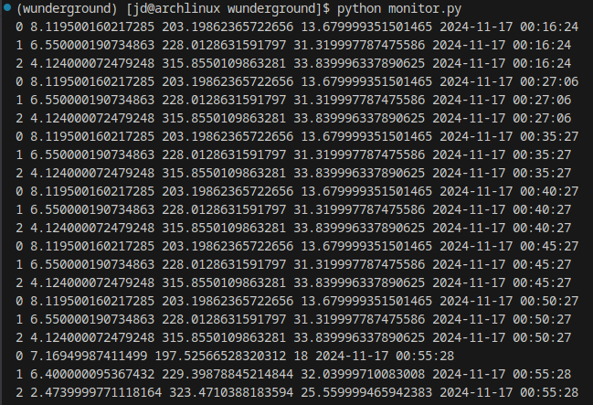

# Scheduled Weather API Aggregator Script
A quick python project I created this weekend that uses openmeteo's free weather API to collect temperature and wind data for multiple locations on a period of every five minutes. The data is restructured and stored within a persistent sqlite3 db where it can be monitored and accessed in the future. 

A display of the information stored in the db as seen in the terminal.

I intially started this project with the idea of using wunderground as the API but discovered that to gain access I would have to setup my own weather station to get an API key. (weather stations are more affordable than I thought! I saw some as low as $150) After attempting to use an API key I found online I then pivoted to [open-meteo](https://open-meteo.com) which has a great (FREE) API for weather forecast data!

After completing the first step of finding a usable API I went ahead and setup a limited test that I could pull data from open-meteo. After a successful test I went ahead and played with the API until I was getting the temperature and wind data from multiple locations like I wanted. The next step was saving this data in persistent storage. For this, I went with sqlite3 as most of the functionality I needed is baked into python already.

For the final step of setting up some sort of recurring API call I did some research and landed on using schedule and time python packages to pull data every five minutes. If I come back to this project this might be one of the decisions I would change. I ran into a few different options for job scheduling and have yet to look at the pro and con lists for each. What I landed on is successful which was my goal for this small project.